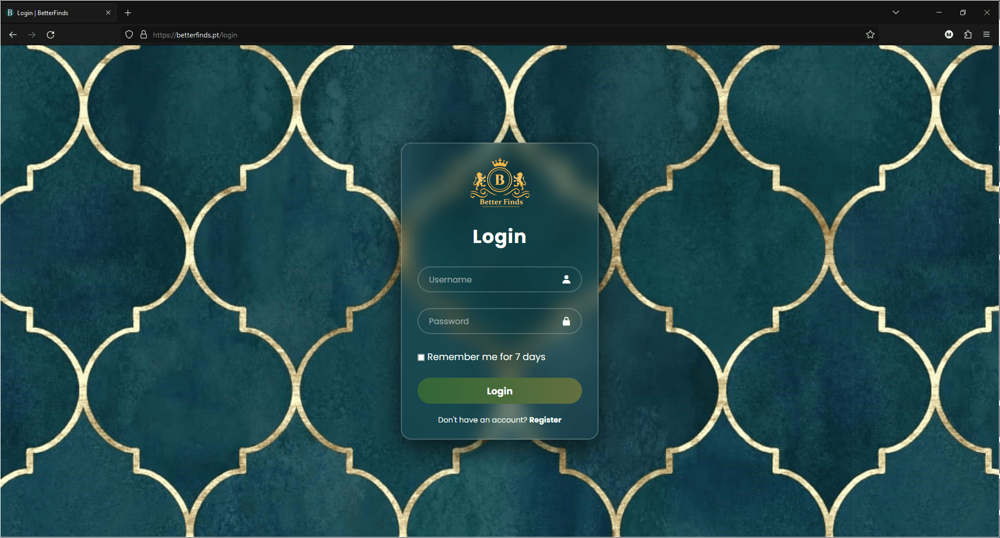
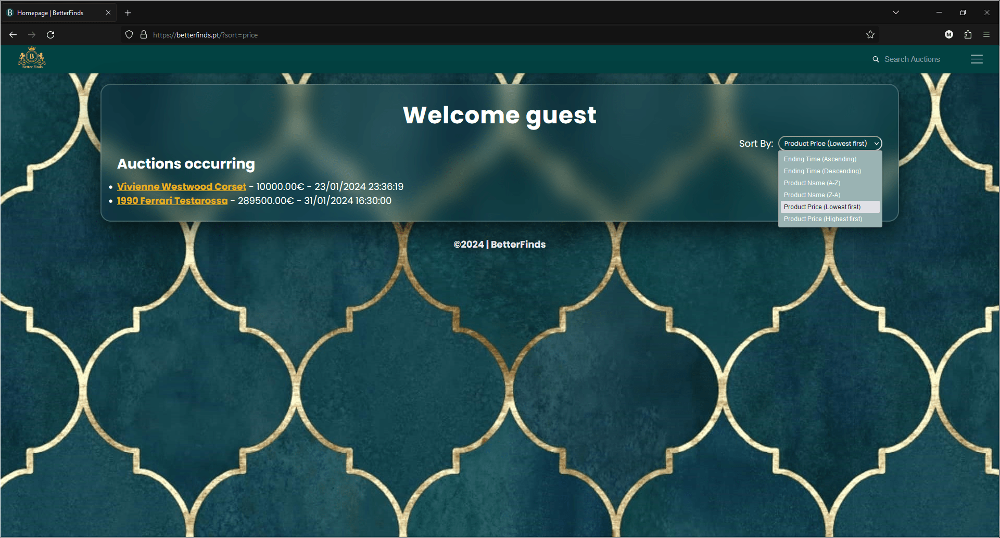
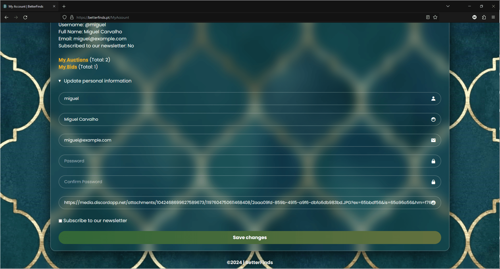
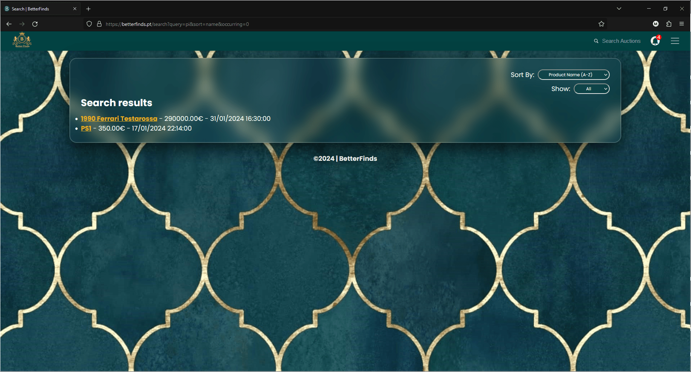
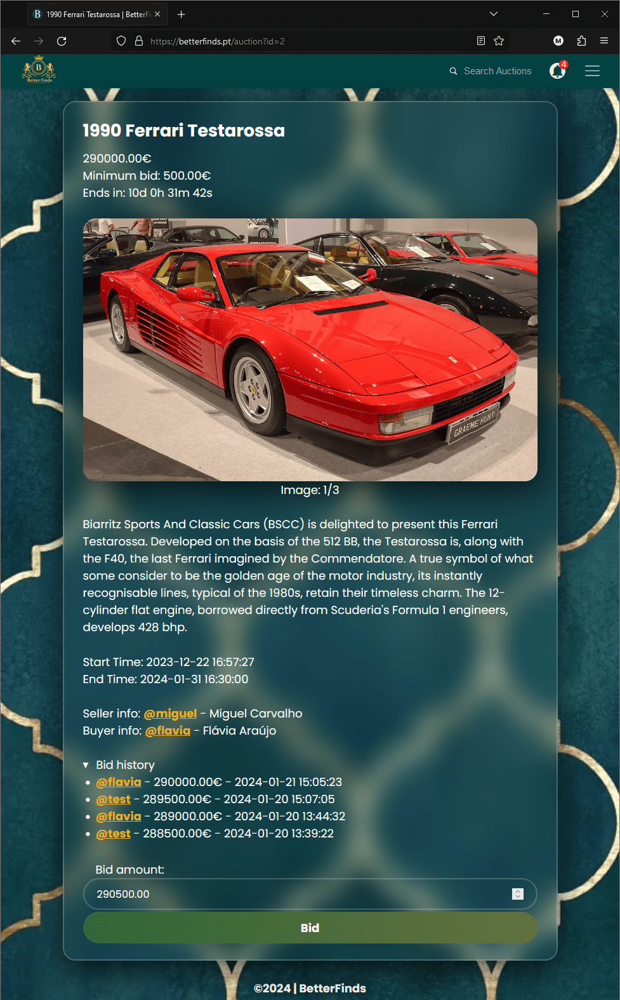
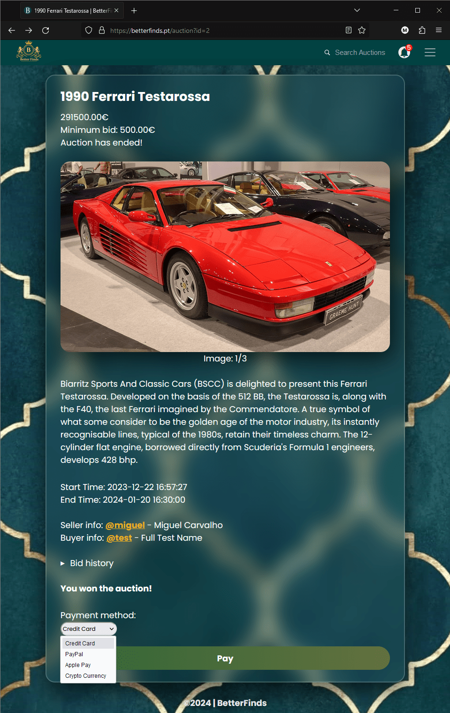
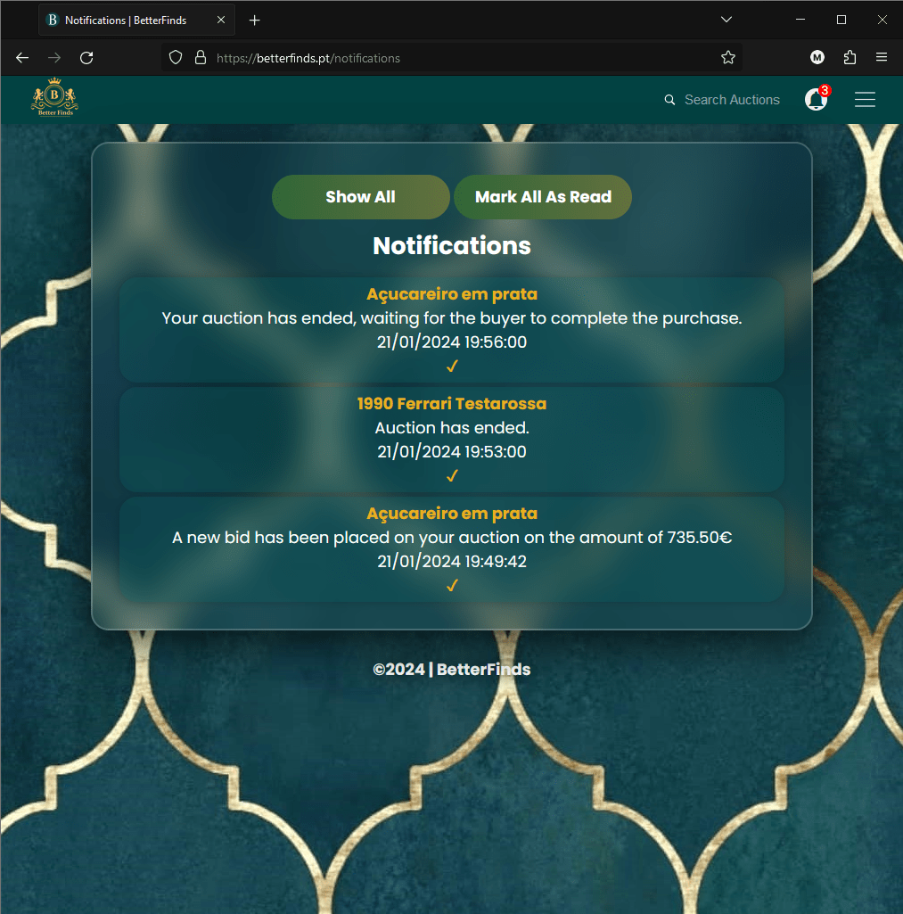

    <h1>Website Preview</h1>

<a href="/">Go back to the main page</a>

    <kbd>
        
         
        Register page
    </kbd>

 

    <kbd>
        
         
        Login page
    </kbd>

 

    <kbd>
        
         
        Logout button
          
        
         
        Redirect after logout
    </kbd>

 

    <kbd>
        
         
        Homepage
    </kbd>

 

    <kbd>
        
         
        My Account page
          
        
         
        Edit account details
    </kbd>

 

    <kbd>
        
         
        Public account page
    </kbd>

 

    <kbd>
        
         
        Search page
    </kbd>

 

    <kbd>
        
         
        My Bids page
    </kbd>

 

    <kbd>
        
         
        My Auctions page
    </kbd>

 

    <kbd>
        
         
        Create Auction page
    </kbd>

 

    <kbd>
        
         
        Auction page (buyer perspective)
          
        
         
        Auction page (seller perspective)
          
        
         
        Auction page (payment method)
    </kbd>

 

    <kbd>
        
         
        Notifications page
          
        
         
        Notifications page (show all)
          
        
         
        Notifications page (no unread notifications)
    </kbd>

 

    <kbd>
        
         
        404 error page
    </kbd>

 

    <a href="/">Go back to the main page</a>

