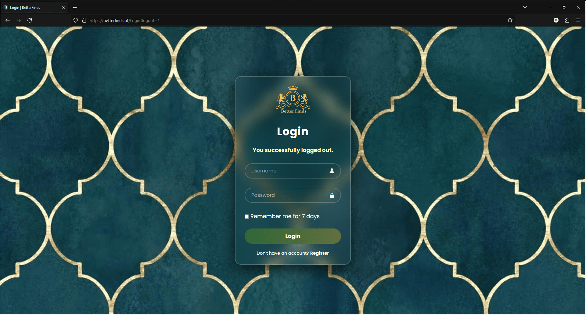
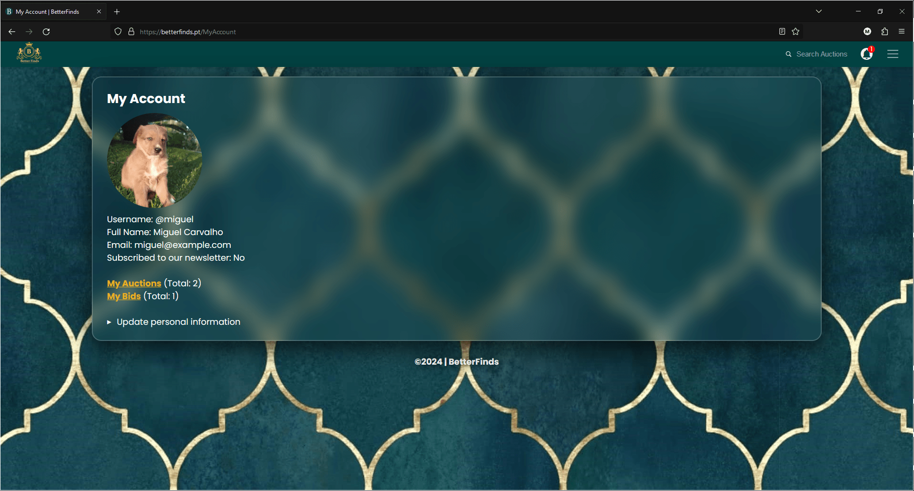
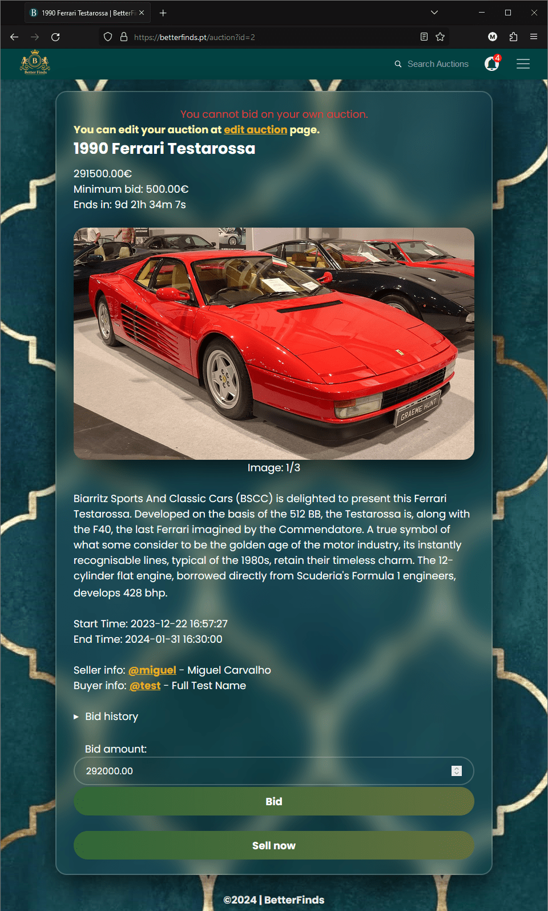
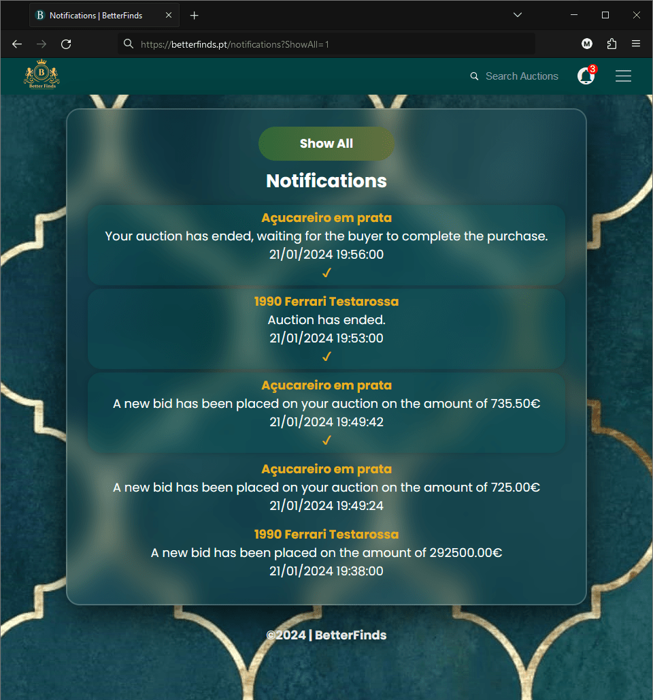

[](https://github.com/migueltc13/project-li4/actions/workflows/dotnet.yml)
[](https://github.com/migueltc13/project-li4/actions/workflows/static.yml)

<div align="center">
    
</div>
<br />

**BetterFinds** is an Auction house website implemented in **ASP.NET** within the **Computer Labs IV** environment in the lective year 2023/2024.

## Introduction

**BetterFinds** is a comprehensive online platform designed to facilitate auction-related activities.

It provides a user-friendly interface for its users, making the process of buying and selling items at auctions convenient and efficient.

The main goals of **BetterFinds** include:

- Streamlining the auction process.
- Enhancing the user experience for both buyers and sellers.
- Providing a secure and transparent environment for online auctions.

## Preview

<div align="center">
    
</div>

<div align="center">
    
</div>

<details>
    <summary><b>Click for more images</b></summary>
    <br />
    <div align="center">
        <kbd>
            
            <br />
            <span>Register page</span>
        </kbd>
    </div>
    <br />
    <div align="center">
        <kbd>
            
            <br />
            <span>Login page</span>
        </kbd>
    </div>
    <br />
    <div align="center">
        <kbd>
            
            <br />
            <span>Logout button</span>
            <br /><br />
            
            <br />
            <span>Redirect after logout</span>
        </kbd>
    </div>
    <br />
    <div align="center">
        <kbd>
            
            <br />
            <span>Homepage</span>
        </kbd>
    </div>
    <br />
    <div align="center">
        <kbd>
            
            <br />
            <span>My Account page</span>
            <br /><br />
            
            <br />
            <span>Edit account details</span>
        </kbd>
    </div>
    <br />
    <div align="center">
        <kbd>
            
            <br />
            <span>Public account page</span>
        </kbd>
    </div>
    <br />
    <div align="center">
        <kbd>
            
            <br />
            <span>Search page</span>
        </kbd>
    </div>
    <br />
    <div align="center">
        <kbd>
            
            <br />
            <span>My Bids page</span>
        </kbd>
    </div>
    <br />
    <div align="center">
        <kbd>
            
            <br />
            <span>My Auctions page</span>
        </kbd>
    </div>
    <br />
    <div align="center">
        <kbd>
            
            <br />
            <span>Create Auction page</span>
        </kbd>
    </div>
    <br />
    <div align="center">
        <kbd>
            
            <br />
            <span>Auction page (buyer perspective)</span>
            <br /><br />
            
            <br />
            <span>Auction page (seller perspective)</span>
            <br /><br />
            
            <br />
            <span>Auction page (payment method)</span>
        </kbd>
    </div>
    <br />
    <div align="center">
        <kbd>
            
            <br />
            <span>Notifications page</span>
            <br /><br />
            
            <br />
            <span>Notifications page (show all)</span>
            <br /><br />
            
            <br />
            <span>Notifications page (no unread notifications)</span>
        </kbd>
    </div>
    <br />
</details>

## Usage

Whether you are a buyer or a seller, **BetterFinds** offers a range of features to meet your
auction needs. Here's a brief overview of how you can use **BetterFinds**:

- **As a buyer:**
  - Browse through a diverse range of auction listings.
  - Search for items by name or description and sort by alphabetical order, price or ending date.
  - Place bids on items you are interested in.
  - Monitor auction progress with live updates and receive notifications on bid updates in auctions you are participating in.
  - View your bidding history and track your activity, organized by auction.
  - Successfully win and pay for items you have bid on.

- **As a seller:**
  - Create and list items for auction, with the possibility of editing and deleting them.
  - Set the starting price and minimum bid increments for your items.
  - Track bidding activity with live updates and through our notifications system.
  - Successfully close auctions and fulfill transactions with winning bidders.

Note that **BetterFinds** users can be both buyers and sellers, and to take advantage of all
the features it has to offer, you should create an account and log in, with most of the features
being exclusive to registered users.

## Architecture

**BetterFinds** is built using the **ASP.NET** framework and **C#** programming language.

It uses the **Razor Pages** model, which is a page-based programming model that makes building web UI easier and more productive.

The **BetterFinds** project is organized into the following directories:
- **Pages:** Contains the **Razor Pages** that make up the **BetterFinds** website and their corresponding code-behind files.
- **Utils:** Contains utility classes used throughout the project.
- **Services:** Contains the asynchronous services used at the start of the application.
- **Hub:** Contains the **SignalR** hub used for real-time updates.

## How to run

To run **BetterFinds**, you should use the **.NET Core 8.0 Runtime**, but it may also work with other versions of **.NET Core**.

You will also need to have a **MSSQL** database server running on your machine. The database
connection string can be configured in the `appsettings.json` file, located in [BetterFinds/](BetterFinds/).

```json
{
  "ConnectionStrings": {
    "DefaultConnection": "Server=localhost;Database=master;User Id=sa;Password=your_password;TrustServerCertificate=True;Encrypt=True"
  }
}
```

Next you will need to configure the **MSSQL** server by running the **T-SQL**
scripts located in the [sql](BetterFinds/sql) directory.

To run the **BetterFinds** project locally from the source code, follow these steps:
1. Open a terminal or command prompt.
2. Navigate to the root directory of the [BetterFinds](BetterFinds) project.
3. Run the following command:
    ```sh
    # Run from source
    dotnet run --environment Production

    # Alternatively, you can run from realease
    # Create a release build
    dotnet publish --configuration Release
    # Run the release build
    dotnet bin/Release/net8.0/BetterFinds.dll
    ```
4. Wait for the application to build and start. Once it's running, you can access **BetterFinds**
   by navigating to the specified address (usually **http://localhost:5000**).

## Testing

**BetterFinds** uses the **NUnit** testing framework for automated unit testing. To run the tests, follow these steps:
1. Open a terminal or command prompt.
2. Navigate to the root directory of the `Tests` project.
3. Run **BetterFinds** locally using one of the methods described in the previous section.
4. Specify the ``connectionString`` on the ``Utils/Sql.cs`` file, similar to the one in the ``appsettings.json`` file mentioned previously.
5. Specify the url variable in the ``UnitTest.cs`` file located in the ``Tests`` project.
6. (Optional) Specify ``lt_username`` and ``lt_accesskey`` variables in the ``UnitTest.cs`` file if you want to load tests to **LambdaTest**.
7. (Otherwise) Uncomment the **Selenium** localhost driver in the ``UnitTest.cs`` file.
8. Run the following command:
    ```sh
    dotnet test
    ```
9. Wait for the tests to run. The results will be displayed in the terminal.

<div align="center">
    <kbd>
        <a href="https://www.youtube.com/watch?v=x7-RagEUBDU">
            
        </a>
        <br />
        <h3>View this video to witness various website features in action.</h3>
        <h3>This demonstration efficiently showcases a variety of tests, providing a clear snapshot of the platform's capabilities.</h3>
    </kbd>
</div>

## Report

Explore the project "backstage" details on the [report file](report/BetterFinds.pdf) for extensive details
on all the motivation and planning behind **BetterFinds**, as well as an assortment of diagrams, use cases and testing processes
that took place as the team built the foundations of the application.

## Documentation

Explore the project documentation on the [main doc page](https://migueltc13.github.io/project-li4/) for comprehensive details and information
regarding the structure, classes, and functions employed in **BetterFinds**.

## Presentation

Refer to the [report/](report/) directory for the [final report](report/BetterFinds.pdf), [presentation](https://www.canva.com/design/DAF6uJ9BqxQ/jiXiwF7ahn7QazI3Kni-sA/view) and related files.

## Authors

**BetterFinds** was developed by the following team of students:
- [Flávia Araújo](https://github.com/flaviaraujo)
- [Miguel Carvalho](https://github.com/migueltc13)

### Final Grade: 17

